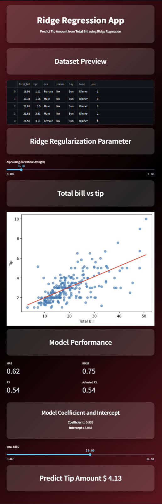

# Ridge Regression App

A Streamlit app to explore and predict restaurant tips using Ridge Regression on the `tips` dataset.

## Live Demo

- Deployed app: https://ridge-r-prediction.streamlit.app/

## Preview



## Features
- Loads the classic `tips` dataset and shows a preview.
- Trains a Ridge Regression model (Total Bill → Tip) with adjustable regularization.
- Interactive slider to control Alpha (regularization strength) parameter.
- Displays model metrics (MAE, RMSE, R², Adjusted R²).
- Scatter plot with fitted regression line.
- Interactive slider to predict tip for a selected bill amount.

## Setup
```bash
pip install -r requirements.txt
```

## Run Locally
```bash
streamlit run app_ridge.py
```

## Deploy
You can deploy easily on Streamlit Community Cloud:
1. Push this repo to GitHub (already set up at `origin`).
2. Go to https://share.streamlit.io, connect your repo, choose `app_ridge.py` as the entry point, and deploy.

## Notes
- Ensure your environment has the packages in `requirements.txt`.
- Ridge Regression includes L2 regularization, controlled by the Alpha parameter.
- Ridge regression shrinks coefficients towards zero but doesn't eliminate them completely.
- If you rename or relocate the screenshot, update the image path in this README.
